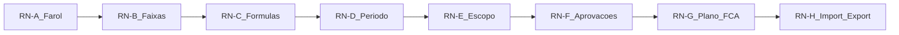

# Roadmap — Validação de regras de negócio (Gestiona)

**Objetivo:** provar, com evidência, que as regras de negócio do Gestiona estão
corretas e prontas para o dia a dia da Capricórnio — não só “a tela abre”.

**Criado:** 2026-10-01  
**Produção:** https://quattrus-clone.vercel.app · Supabase `quattrus-clone`  
**Relacionados:** [roadmap-paridade-quattrus.md](./roadmap-paridade-quattrus.md) ·
[roadmap-debug-matriz-testes.md](./roadmap-debug-matriz-testes.md) ·
[permissions-matrix.md](./permissions-matrix.md) ·
[functional-mapping.md](./functional-mapping.md)

Espelho Obsidian (opcional): `Projetos/Gestiona/Roadmap-Validacao-Regras-Negocio.md`.

## Diferença dos outros roadmaps

| Documento | Pergunta |
| --- | --- |
| Paridade | O fluxo parece o Quattrus? |
| Debug / matriz QA | Tem bug de UI/regressão? |
| **Este** | A **regra** (farol, escopo, fórmula, lock, aprovação…) calcula e autoriza certo? |

**Pronto quando:** cada domínio abaixo tem fixture Capricórnio (ou caso sintético
documentado) + resultado `OK` / `FALHA` / `N/A` com evidência (auto e/ou manual).

## Como executar

1. Escolha um **domínio** (RN-A … RN-H).
2. Rode o pacote **Auto** indicado (`npm test -- <arquivo>` ou suite).
3. Complete os casos **Manual** com conta de smoke + 1–2 KPIs reais da Capricórnio.
4. Preencha a coluna Resultado no [log de execução](#log-de-execuções).
5. Se `FALHA`: abra achado (severidade + esperado × atual + arquivo fonte).

Severidade: **S1** fecha ciclo errado / perde dado · **S2** farol ou fórmula errada ·
**S3** escopo/UX de regra · **S4** documentação.

**Regra de ouro:** nunca imputar zero onde o negócio pede `SEM_DADO`
(skill `gestiona-validar-dados-kpi`).

---

## Domínios e fases



| Fase | Domínio | Critério de pronto |
| --- | --- | --- |
| **V0** | Inventário | Esta matriz + fontes de verdade no código |
| **V1** | RN-A + RN-B | Farol % / absoluto / vigência batem com fixtures |
| **V2** | RN-C + RN-D | Fórmulas + period lock + mês futuro |
| **V3** | RN-E + RN-F | Escopo (dono/delegado/admin) + aprovações |
| **V4** | RN-G + RN-H | FCA bloqueio + Gantt datas + import não corrompe |
| **V5** | Assinatura | Relatório Capricórnio + gaps aceitos documentados |

Ordem sugerida: **V0 → V1 → V2 → V3 → V4 → V5**.

---

## Fontes de verdade (código)

| Domínio | Arquivos |
| --- | --- |
| Farol / desvio / direção | `src/lib/kpi.ts` (`getKpiStatus`, `getDeviationPct`, `thresholdsForPeriod`) |
| Faixa + band chart | `src/lib/kpi.ts`, `src/lib/band-chart.ts`, `src/lib/farol-tree.ts` |
| Fórmulas | `src/lib/kpi-formula.ts`, `src/lib/kpi-cascading.ts` |
| Period lock | `src/lib/period-locks.ts`, `src/lib/period.ts` |
| Escopo / escrita | `src/lib/authz.ts`, `src/lib/hierarchy.ts`, [permissions-matrix.md](./permissions-matrix.md) |
| Aprovações | `src/lib/actions.ts` (goal/forecast approve), UI `/aprovacoes` |
| FCA / Gantt | actions plano + `assertFcaResolved`, `ActionPlanGantt` |
| Import | `src/lib/import-actions.ts`, fila `import-queue` |

---

## Matriz de regras

Legenda Resultado (na execução): `OK` · `FALHA` · `N/A` · `PENDENTE`.

### RN-A — Farol e polaridade

| ID | Regra | Esperado | Auto | Manual Capricórnio |
| --- | --- | --- | --- | --- |
| A1 | `actual` null → `SEM_DADO` | Sem inventar 0 | `kpi.test` | Abrir KPI sem realizado no mês |
| A2 | Direção MORE: acima/igual meta → VERDE | Desvio ≥ 0 = verde | `kpi.test` | KPI “maior melhor” |
| A3 | Direção LESS: abaixo/igual meta → VERDE | Invertido vs MORE | `kpi.test` | KPI “menor melhor” |
| A4 | Direção EQUAL: qualquer desvio | Penaliza distância | `kpi.test` | Se existir EQUAL |
| A5 | % amarelo / vermelho / crítico | Faixas yellow ≤ red | `kpi.test` | Conferir bolinha vs meta/real |
| A6 | Mesmo farol em farol / detalhe / multi / export | Série e cor iguais | `band-chart` + parity | 1 KPI nos 3 lugares |

### RN-B — Faixas (% e absoluta) + vigência

| ID | Regra | Esperado | Auto | Manual Capricórnio |
| --- | --- | --- | --- | --- |
| B1 | Modo PERCENT | Tolerância % da meta | `kpi.test` | Cadastro Tipo |
| B2 | Modo ABSOLUTE dentro [inf, sup] | VERDE | `kpi.test` | Limites reais |
| B3 | ABSOLUTE MORE acima do sup | Continua VERDE | `kpi.test` | — |
| B4 | ABSOLUTE LESS abaixo do inf | Continua VERDE | `kpi.test` | — |
| B5 | Vigência: faixa nova em set. | Ago. usa janela antiga | `kpi.test` vigência | Mudar vigência em staging/KPI teste |
| B6 | Meta 0 sem realizado no gráfico | Não plota Meta em y=0 | `band-chart` | Barras no farol |
| B7 | Meta do Cliente / amplitude | Persistidos; amplitude ainda informativa | Schema + UI | Conferir campos salvos |

### RN-C — Fórmulas e cascata

| ID | Regra | Esperado | Auto | Manual Capricórnio |
| --- | --- | --- | --- | --- |
| C1 | MANUAL | Usa valor lançado | `kpi-formula` | — |
| C2 | SUM / AVERAGE | Ignora null; vazio = NO_DATA | `kpi-formula` | Totalizador real |
| C3 | WEIGHTED | Pesos aplicados | `kpi-formula` / cascading | — |
| C4 | QUOTIENT denom 0 | `null` + ZERO_DENOMINATOR | `kpi-formula` | KPI razão |
| C5 | TOTALIZER / cascata pai-filho | Filho altera pai | `kpi-cascading` | Árvore Capricórnio |
| C6 | Casas decimais / coeficiente | Exibição e totalização coerentes | Manual + schema | Conferir 1 PMB |

### RN-D — Período, lock e futuro

| ID | Regra | Esperado | Auto | Manual Capricórnio |
| --- | --- | --- | --- | --- |
| D1 | Period lock global | Bloqueia medição/import (admin incluso) | `period-locks` | Fechar ciclo teste |
| D2 | Lock por departamento | Só aquele depto | Manual | Se usado |
| D3 | Mês futuro | UI disabled + action rejeita | measurement / farol | Tentar mês+1 |
| D4 | Mensagens FECHADO / futuro | Texto claro ao usuário | Manual | — |

### RN-E — Escopo, delegação e visibilidade

| ID | Regra | Esperado | Auto | Manual Capricórnio |
| --- | --- | --- | --- | --- |
| E1 | COLABORADOR só vê o seu | `/metas` /medições próprios | Manual 2 users | Conta colaborador |
| E2 | GESTOR vê subordinados | Farol/export da árvore | Manual | Hierarquia real |
| E3 | ADMIN vê farol amplo | `exportableOwnerIds` | Manual (`teste`) | Já observado no smoke |
| E4 | Delegação de item | Edita só aquele KPI | Manual | Criar delegação teste |
| E5 | Facilitação do dono | Edita todos do dono | Manual | — |
| E6 | Arquivado | Só ADMIN escreve | Manual | Arquivar KPI teste |
| E7 | Auxiliar | Sai de % principal / aba Auxiliares | Manual | Flag auxiliar |
| E8 | Vermelho crônico N | Flag após N meses vermelhos | Manual + dados | Se N configurado |

### RN-F — Aprovações e previsões

| ID | Regra | Esperado | Auto | Manual Capricórnio |
| --- | --- | --- | --- | --- |
| F1 | Meta pendente → aprovar inline | Status aprovado; valor gravado | Manual | Fila real |
| F2 | Aprovar em lote | Só pendentes selecionáveis | Manual | — |
| F3 | Previsão Motivo / Solicitação / Status | Colunas e decisão | Manual | `/aprovacoes/previsoes` |
| F4 | Sem permissão não aprova | 403 / mensagem | Manual | User sem papel |

### RN-G — Plano de ação, FCA e tarefas

| ID | Regra | Esperado | Auto | Manual Capricórnio |
| --- | --- | --- | --- | --- |
| G1 | Fora da meta gera/exige FCA | Fluxo 5 Porquês disponível | Manual | KPI vermelho |
| G2 | FCA pendente mês anterior | Bloqueia novo lançamento | authz / actions | Conforme `assertFcaResolved` |
| G3 | Gantt drag atualiza datas | Persistência mensal | Manual | 1 etapa |
| G4 | Etapa atrasada | Aparece em `/tarefas` Atrasada | Manual | Data fim < hoje |
| G5 | FCA e Gantt coexistem | UI explica quando usar cada | Manual | Banner `/fca` |

### RN-H — Importação e exportação

| ID | Regra | Esperado | Auto | Manual Capricórnio |
| --- | --- | --- | --- | --- |
| H1 | Linha inválida | Não corrompe válidas; erro por linha | `import-actions` | CSV misto |
| H2 | Fila ≥40 | ENFILEIRADO → terminal | Manual (já smoke) | — |
| H3 | Concorrência | 2º import bloqueado | Manual (já smoke) | — |
| H4 | Import em período fechado | Rejeita | Auto + Manual | — |
| H5 | Export respeita escopo | Só owners visíveis | Manual | Comparar admin vs colaborador |
| H6 | `.xls` binário | Recusa clara (fora de escopo) | Manual | Arquivo legado |
| H7 | PDF reunião / medições | 200 application/pdf | Manual (já smoke) | — |

---

## Fixtures Capricórnio (preencher)

Usar KPIs reais (código IC-…) sem inventar números em produção. Preferir staging
ou KPI smoke.

| Fixture | KPI / código | Período | Regra coberta | Owner validação |
| --- | --- | --- | --- | --- |
| F-MORE-% | | | A2, A5, B1 | |
| F-LESS-% | | | A3 | |
| F-ABS | | | B2–B4 | |
| F-VIG | | ago. + set. | B5 | |
| F-QUOT | | | C4 | |
| F-TOT | | | C5 | |
| F-DELEG | | | E4 | |

---

## Automação já existente

```bash
cd quattrus-clone
npm test                 # suite completa
npm test -- kpi          # farol / faixas / vigência
npm test -- kpi-formula
npm test -- kpi-cascading
npm test -- period-locks
npm test -- band-chart
npm test -- import-actions
npm run typecheck
```

Gaps de auto (ainda manuais de negócio): E1–E8 com 2 perfis reais, F1–F4 com
fila, G1–G5 com plano real, fixtures Capricórnio nomeadas acima.

---

## Log de execuções

| Data | Fase | Relatório | Auto | Manual | OK / FALHA / PENDENTE |
| --- | --- | --- | --- | --- | --- |
| 2026-10-01 | V0 | Este doc criado | — | — | Inventário pronto |
| 2026-10-01 | V1–V4 | [mudancas/2026-10-01-validacao-regras-negocio.md](./mudancas/2026-10-01-validacao-regras-negocio.md) | 113 RN + 399 suite; typecheck OK | Smoke browser `teste` em prod; VIEW sem mutação | **14 OK · 0 FALHA · 10 N/A** (foco A1–A6, B1–B6, C4, D1/D3, E3/E7, F1–F3, G5, H5–H7) |
| | V5 | | | | |

Modelo de relatório de rodada: `docs/mudancas/YYYY-MM-DD-validacao-regras-negocio.md`
(copiar tabela do domínio + evidências).

---

## Achados (regras)

| Data | ID | Sev | Esperado | Atual | Owner | Status |
| --- | --- | --- | --- | --- | --- | --- |
| | | | | | | |

---

## Critério de assinatura (V5)

- [ ] V1–V4 sem `FALHA` S1/S2 aberta (ou aceita por escrito)
- [ ] Pelo menos 4 fixtures Capricórnio preenchidas e conferidas
- [ ] `npm test` verde na mesma revisão
- [ ] Lacunas intencionais listadas (ex.: amplitude só informativa; AZUL pouco usado)
- [ ] Responsável Capricórnio assina data abaixo

**Assinatura:** _________________ · Data: ____/____/________
